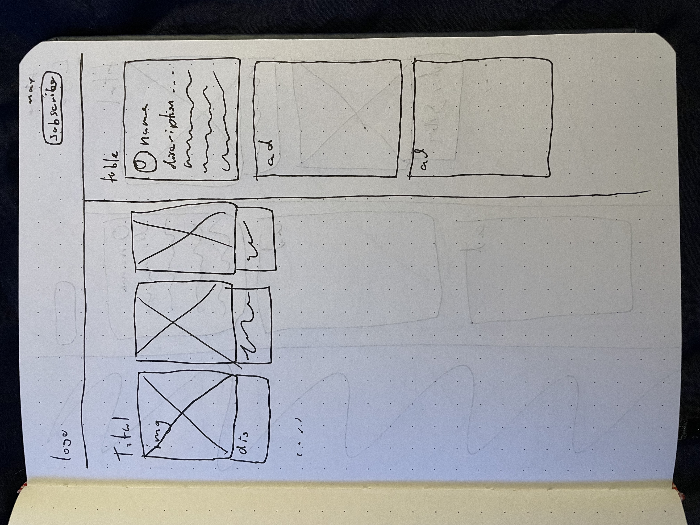
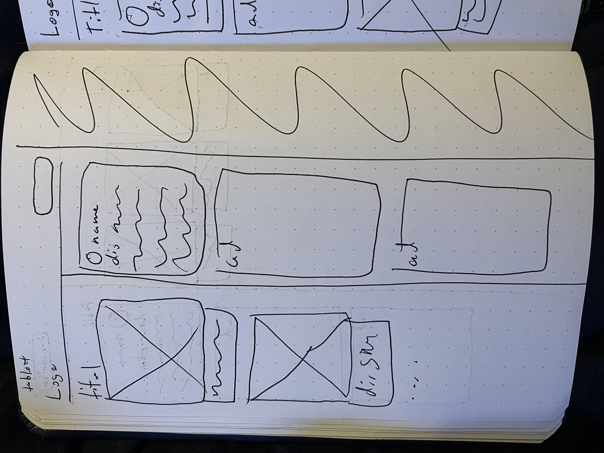
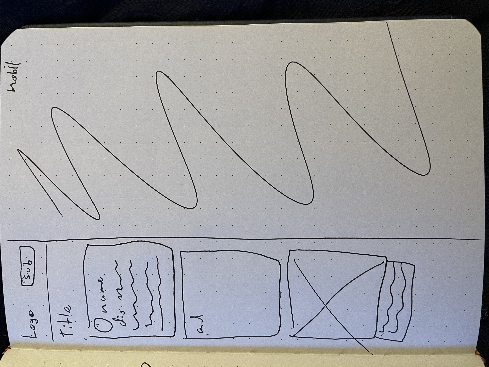

#Process Doc
##The Brief
For this assignment I was asked to construct a website using Eleventy a static site generator. This website would also have to be dynamic for a verity of devices. My website is be based of 60s dinner food and will aim to be as “realistic” as posable with a monetary system in place.

The reason for the topic is all based of the requirement to used the grid. Using the grid would mean that the end website will feel very perpendicular, to contrast this I choose to use the soft edges of the 60s dinner food. 

##The Process
To get inspiration I looked at existing websites around food and menus. In doing so I found meany websites showing a list or gallery of different food from a time period (Allen, 2016). These websites would also have small descriptions of the food. The basic website structure took inspiration from a website called “stay at home mum” which contains 2 main columns. This website also has a section for main content, author, ads, and body text. A book from Betty Crocker inspired the colour of my website and makes the website seem lively and exiting (nancyc, 2010). 

The sketches for this site are used to guide me in making this website. They contain a strong grid system and string column system. The sketches also outline what will happen at braking points to keep the website usable on alternative devices. The pages is design to be informative and monetisable. To ensure the site is monetisable the page will include ads under the author.

The site will also include the author and brief description of them. This information will be displayed on the right side of the page for desktop and table sizes and on the bottom for mobile. The grid system will also dynamically change to fit to the page and still be visible.

When using the static site generator the benefit become obvious. To construct a webpage multiple files work together to make a site. A markdown file is used for all the content, this is titles, body texts and images are allocated. This file is then feed into the html and file to be placed in the correct places and order. From here the css is also assigned to construct the page in the way it was intended to look. 

For a website like this a static site generator is useful to use. This is because no new code will have to be used or made for other topics. The content will only have to be outlined in the markdown file. 

##Reflection
In reflection, I believe the the website is simple and works to demonstrate my skill with working with a static site generator. The layout changes dynamically and makes great use of the column system and grid system. It also looks like the structure of a realistic website and would work as a blog in its current state. The website also includes ads to make the website monetisable.

However the website could have looked more professional if I took more time to plan and sketch my site. The colours, despite fitting the theme of the site don't look very professional and “realistic”.

If I had more time to work on the assignment I would have put further work into understanding the file structure and how the files talk to one another. If I were to understand this I would have been able to further edit the structure and css of the header and footer. 

##Bibliography
Alejandra Ramos. (2010). A 1960s Cocktail Party. Retrieved from ALWAYS ORDER DESSERT website: http://www.alwaysorderdessert.com/2009/12/1960s-cocktail-party.html
Allen, J. (2016, April 16). Gross Food We Ate in the 50’s, 60’s and 70’s - Stay at Home Mum. Retrieved from stay at home mum website: https://www.stayathomemum.com.au/recipes/gross-food-we-ate-in-the-50s-60s-and-70s/
nancyc. (2010, October 20). Vintage Betty Crocker: Butter Cookies. Retrieved May 10, 2022, from NancyC website: https://nancy-c.com/2010/10/20/vintage-betty-crocker-butter-cookies/
Woolworths. (n.d.). Woolworths Corn Sweet Kernels 420g | Woolworths. Retrieved from www.woolworths.com.au website: https://www.woolworths.com.au/shop/productdetails/218926/woolworths-corn-sweet-kernels
Yeoman Lowbrow. (2015, April 28). Meals in a Mold: The Mid-Century’s Love Affair with Gelatin  - Flashbak. Retrieved from Flashbak website: https://flashbak.com/meals-in-a-mold-the-mid-centurys-love-affair-with-gelatin-34213/